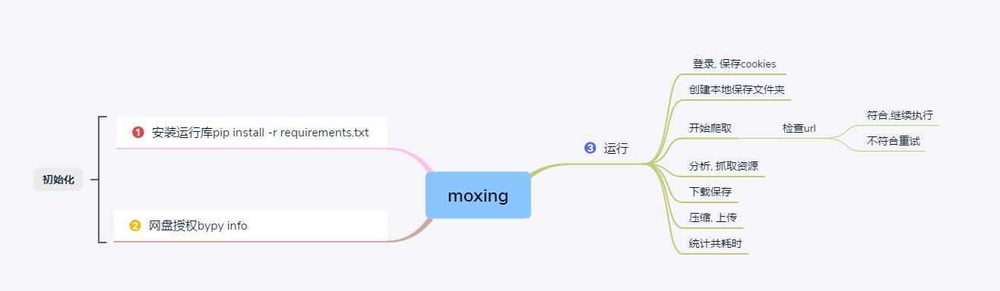

# README
*****
[](https://github.com/Amd794)

# 特点
- [x] 登录维持, 保证资源稳定下载
- [x] 自动爬取保存资源
- [x] 仿站保存, 方便离线观看
- [x] 资源自动压缩上传
- [ ] 加入稳定高效代理池支持
- [ ] 论坛资源更新邮箱推送
- [ ] 破解加密算法, 最大限度优化爬取速度

# 预览



# 使用
+ python包的安装. pip install -r requirements.txt
+ 第一次运行时需要授权，你需要在命令行下跑一下bypy info(或其它bypy)命令, 然后跟着说明（登陆等）来授权即可。授权只需一次，一旦成功，以后不会再出现授权提示
  + 注意:想要支持中文，你要把系统的区域编码设置为UTF-8。（参见：http://perlgeek.de/en/article/set-up-a-clean-utf8-environment)
  
# 关键代码
### 上传
```python
bp = ByPy()
bp.mkdir(remotepath='bypy')  #在网盘中新建目录
bp.upload(localpath=folderName, remotepath=folderName,
              ondup='newcopy')  # 将本地文件上传到百度云盘中
```
### 压缩文件
```python
zp = ZipFile(folderName+'.rar', 'a')
warnings.filterwarnings('error')  # 将警告转换为异常,ignore忽略警告
zp.write('./'+folderName+os.sep+fileName)
```

### 付费
```python
# 获取付费资源
def attachpay(formhash, aid, tid):
    data = {
        'formhash': formhash,  # 关键参数, 为了服务端的session能识别, 返回正确的下载路径
        'referer': 'https://www.moxing.fyi',  # 重定向, 写不写没影响
        'aid': aid,  # 附件对应的aid
        'buyall': 'yes'  # 获取所有附件
    }
    response = requests.post(
        url='https://www.moxing.fyi/forum.php?mod=misc&action=attachpay' +
            '&tid={tid}&paysubmit=yes&infloat=yes&inajax=1'.format(tid=tid),
        data=data)
    print(response.text)
```
*****
# 日志
+ 2019/4/14
  + 更新付费资源的自动解析读取, 让操作更便捷


